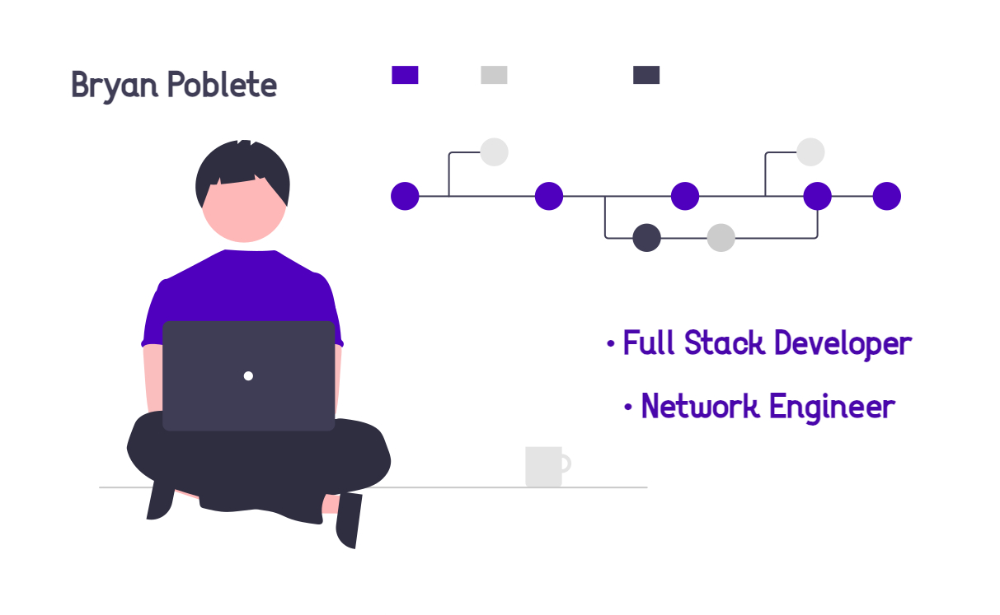

<!--Banner-->

<!--Header-->
<h1 align="center"> 👋 Hi, I'm Bryan Poblete, Welcome to my profile ! 👋 </h1>

<!--About me-->      
<h3 align="left">About me</h2>

I have been passionate about technology since I was a child. I have always been interested in understanding how this digital world works. Currently, I am studying software development as a Full Stack JavaScript student at Generation Chile, an organization that prepares professionals for the future in IT. 
Previously, I also studied Network Engineering, where I was able to enrich myself with skills in computing, networks, telecommunications and cybersecurity. Thanks to this, I had the opportunity to work as a support engineer at a cybersecurity company, which provided me with technical experience in this field and helped me develop soft skills.

 

Check out my portfolio ! (IN PROGRESS)

<!--Technologies and languages-->       
<h2 align="center">💻 Technologies 💻</h2> 

 

<!-- Social Networks --> 
<h2 align="center"> 🌐 Contact Me 🌐 </h2>

 
 
 
 

 

Feel free to contact me 😊

 
